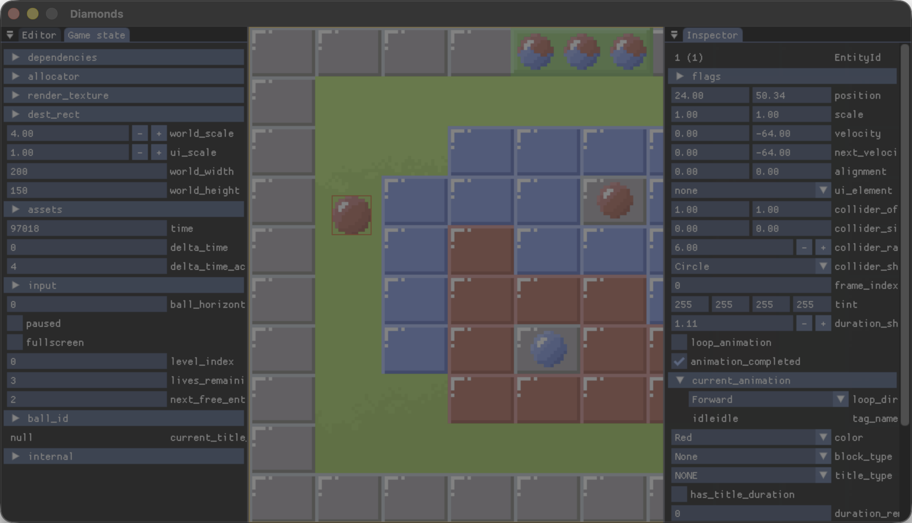

# Introducing Flint

2026-04-04

[Flint](https://github.com/zoeesilcock/flint) is a set of building blocks for creating your own game engine. Every game is different, and a general purpose engine is rarely the best fit for any specific one. Flint gives you the key ingredients to put together an engine that makes sense for *your* game, and helps you get up and running quickly.

## Execution

The core part of Flint is an executable which creates a window and loads a dynamic library containing your game code. When make changes to the code, Flint detects it, rebuilds your library, and loads it into the running game, no manual rebuild or restart needed. Assets work the same way, so you can tweak a sprite and see the result instantly. Iteration speed and easy experimentation are central to what Flint provides. Flint also provides initialization logic at different levels: you can go with a full setup for 2D rendering (SDL Renderer) or 3D rendering (SDL GPU), or choose the minimal setup which just gives you a window and lets you do everything else yourself.

## On the shoulders of giants
Flint builds on the shoulders of giants and the choices made here are a part of the opinionated nature of the project.

* **Zig**: chosen for C interoperability and cross compilation. Cross compilation is important because it gives the freedom to target various platforms and still develop on whatever OS you prefer. There are many other reasons why I picked Zig, but I think the most important was that I enjoy reading and writing Zig code.
* **SDL**: chosen for its wide platform support. I originally started with Raylib which seemed great, but I wanted a clearer path to potential console ports in the future.
* **Imgui**: chosen due to its widespread usage for this specific use case. Integrating it has been a bit tricky since it is a C++ project, but for now I still see it as the most popular option.

Flint builds both SDL 3 and Imgui from source and exposes them to your game library directly. I have chosen to keep zig bindings minimal and call the C functions directly in most cases.

## Asset loading
Flint can parse Aseprite files which allows for both sprites and sprite animations. In the early stages I am focusing my efforts on the type of graphics that I am interested in, mainly 2D pixel art, but with time I hope to build more things for 3D graphics also. The project already contains a 3D example wich renders a cube, this is the initial exploration into how to work with SDL GPU and I hope that I can move some of that code out to provide an easier way to get started with 3D also.

## Editor UI
The other half of a game engine is the editor tools you use to build your levels, inspect your entities, profile your game and such. Flint provides a set of functions that use comptime to generate inspector windows for structs using Imgui. You also get an FPS counter/graph, a memory usage graph, and a way to output strings to the screen for anywhere in your code. These are all just tools that you can choose to use or ignore if you would rather make your own solutions. You have the full power of Imgui to build whatever editor UIs you need to create efficient workflows.

 *Examples of inspectors generated at comptime using `inspectStruct`.*

## Project status
Flint is still in early development but it is already usable, especially for 2D graphics. But even the parts that work well are still first implementations, so there's room for improvement across the board. Since I only work in this in my spare time, the pace of development is relatively slow and sporadic. That being said, I have a long term commitment to this project and my aim is to base my future game projects on Flint. So who is this project for? Primarily it is for me, but I hope that it can be useful to other game developers also. You can look at the [Guiding principles](https://github.com/zoeesilcock/flint?tab=readme-ov-file#guiding-principles) section of the readme to see if this approach resonates with you.

## Try it out
If you want to give it a try, it's really easy to get up and running using the new project generator. It creates a new project based on the template example. Currently this gives a 2D project, but as more templates are added we'll make it an option in the generator. API documentation is available in the code and [online](https://zoeesilcock.github.io/flint/).
```Bash
# Clone Flint.
git clone https://github.com/zoeesilcock/flint.git && cd flint

# Run the new project generator.
zig build new -- ../my_new_project

# Build and run the new project.
cd ../my_new_project && zig build run
```
